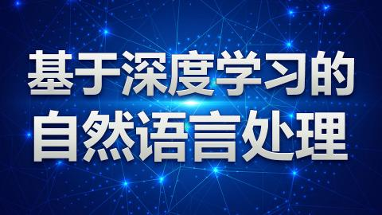

## 课程介绍
自然语言处理是计算机科学领域与人工智能领域中的一个重要方向。它研究能实现人与计算机之间用自然语言进行有效通信的各种理论和方法。过去的五到⼗年的时间，人工智能蓬勃发展，但是作为人工智能皇冠上的明珠——⾃然语⾔处理，作为⼀种更⾼层次的信号表达，是⼈类思想的载体之⼀，成为了人工智能领域最难攻克的领域之⼀。
课程中，我们并不会单纯的去讲解枯燥的理论，精美的 PPT 搭配优美的动画展⽰，将晦涩的理论和⾼深的公式通过⼀步步的拆解，⽤最简单的方式让学员学习到最有⽤的理论。同时，课程中间还会穿插实际的编码课程，不仅着眼于理论，还会让大家能够切⾝体会编码的过程，真实的看到理论是怎么⼀步步变成现实的。
为了让每⼀个学⽣都能保持学习的热情，本次课程会附带课程作业，通过每⼀课的学习希望⼤家能够逐步的完成⼤作业。能够真正的学习到知识并能体会⾃然语⾔处理的魅⼒所在。
[课程地址](http://www.shenlanxueyuan.com/course/75)

## 课程内容
```
第 1 章：自然语言处理是什么（3月4日）
     § 1.1 发展介绍
     § 1.2 主要研究⽅向
     § 1.3 难点
     § 1.4 国内外发展状态和热点
             § 1.4.1 国外发展
             § 1.4.2 国内发展
             § 1.4.3 发展趋势
     § 1.5 NLP 资源
     § 1.6 课程设计思路与⽬标
第 2 章：语言建模与词向量（3月17日）
     § 2.1 建模原理
     § 2.2 基于矩阵的词向量
     § 2.3 基于预测的词向量
     § 2.4 模型求解
第 3 章：词向量 (一)：单语境语⾔建模（3月18日）
     § 3.1 NNLM
     § 3.2 Word2vec
     § 3.3 Glove
     § 3.4 fastText
     § 3.5 字符级建模
第 4 章：词向量 (二)：多语境语⾔建模（3月24日）
     § 4.1 Huang 的模型
     § 4.2 MSSG 模型
     § 4.3 其它模型
第 5 章：词向量训练（3月25日）
     § 5.1 模型选定
     § 5.2 参数详解
     § 5.3 预料选取
     § 5.4 训练效果展⽰
第 6 章：词向量评价（3月31日）
     § 6.1 内部评价⽅式
     § 6.2 外部评价⽅式
第 7 章：RNN 在 NLP 中的应用（4月1日）
     § 7.1 RNN 数学原理
     § 7.2 LSTM
     § 7.3 TextRNN
     § 7.4 Tensorflow 练习
     § 7.5 结果分析
第 8 章：CNN 在 NLP 中的应用（4月7日）
     § 8.1 CNN 数学原理
     § 8.2 TextCNN
     § 8.3 TextRCNN
     § 8.4 Tensorflow 练习
     § 8.5 结果分析
第 9 章：NLP 实战之文本分类（4月8日）
     § 9.1 ⽂本分类原理
     § 9.2 ⽂本分类⽂章讲解
     § 9.3 练习
第 10 章：NLP 实战之情感分析（4月14日）
     § 10.1 情感分析原理
     § 10.2 情感分析⽂章讲解
     § 10.3 练习
第 11 章：NLP 实战之机器翻译（4月15日）
     § 11.1 机器翻译原理
     § 11.2 机器翻译⽂章讲解
第 12 章：NLP 实战之知识图谱（4月21日）
     § 12.1 知识图谱原理
     § 12.2 知识图谱⽂章讲解
     § 12.3 命名实体识别
第 13 章：课程总结（4月22日）
```

## 课程目标
##### 掌握当下主流的自然语言处理方法

##### 实战主流的自然语言处理领域的任务

## 适合人群
##### 具备概率论、微积分、 矩阵等数学知识的基础
##### 熟悉Python编程
##### 了解 Tensorflow 的基础知识
